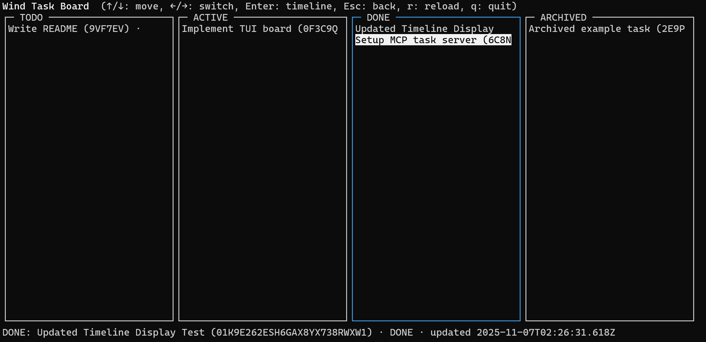

[English](README.md) | [中文](README.zh.md)

MCP Task Server

Minimal MCP server for LLM agents to manage simple tasks backed by files. Lifecycle is TODO → ACTIVE → DONE, with ARCHIVED as a lock (separate board column). Append-only event logs per task provide full history and context.

Features

- States: `TODO`, `ACTIVE`, `DONE`; `ARCHIVED` via `archived_at` (blocks mutations)
- Append-only `events.jsonl` per task; `task.json` holds current view
- Optimistic concurrency with `expected_last_seq`
- Board and index resources; task and timeline resource templates
- No tags, no assignee, no verify

Project Layout

- `src/types.ts` — types for tasks, events, views
- `src/id.ts` — minimal ULID generator (time-sortable IDs)
- `src/store.ts` — file-backed store and operations
- `src/index.ts` — MCP server (stdio transport)
- `.wind-task/` — data directory (per project; see Projects)

Quick Start

- Prereqs: Node 18+ (tested with Node 22)
- Install: `npm install`
- Start server (stdio): `npm run dev`
- Build and run: `npm run build && npm start`
- TUI (read‑only board and timeline): `WIND_PROJECT=projA npm run tui`
  - Or run via npx: `WIND_PROJECT=projA npx wind-task-tui`
  - Server via npx: `npx wind-task`

Config Setup

- Location: `~/.wind-task/config.json` (user-level config)
- Minimal example (recommended: map to your project root; storage goes under ".wind-task"):

  {
    "projects": { "projA": "/abs/path/to/projA" }
  }

- Rules
  - Use absolute paths for `base_dir` (interpreted as project root by default).
  - `~/` expands to your home directory; relative paths are normalized to absolute.
  - The server resolves storage to `<base_dir>/.wind-task` by default and creates it if missing.
  - Backward compatible: if your config value already ends with `/.wind-task`, it is used as-is.
- Verify
  - Read `config://projects` via your MCP host, or open `~/.wind-task/config.json`.
- Common errors
  - Missing `project` on tool calls.
  - Missing `?project=NAME` on resource URIs.
  - Unknown project key (ensure it exists in config).

- See Projects for details.

MCP Surface

- Resources
  - `tasks://index?project={project}` — compact list of tasks (JSON)
  - `tasks://board?project={project}` — board with `TODO`, `ACTIVE`, `DONE`, `ARCHIVED` columns (JSON)
  - `tasks://task/{id}?project={project}` — full `task.json` (JSON)
  - `tasks://timeline/{id}?project={project}` — `events.jsonl` rendered as JSON array (JSON)
  - `tasks://content/{id}?project={project}` — long-form task content (text/markdown)
  - `config://projects` — read-only view of current project mapping (JSON)

- Tools
  - `add_project(project, base_dir)`
  - `update_project(project, base_dir)`
  - `remove_project(project)`
  - `create_task(project, title, summary?, actor)`
  - `retitle(project, id, title, expected_last_seq, actor)`
  - `set_state(project, id, state, expected_last_seq, actor)`
  - `append_log(project, id, message, expected_last_seq, actor)`
  - `set_summary(project, id, summary, expected_last_seq, actor)`
  - `set_content(project, id, content, expected_last_seq, actor, format?)`
  - `archive(project, id, reason?, expected_last_seq, actor)`
  - `unarchive(project, id, expected_last_seq, actor)`

MCP Host Integrations

Claude Code CLI (HTTP)

- Add an HTTP MCP server via CLI:
  claude mcp add --transport http wind-task http://localhost:3000/mcp
- Note: This repo’s server uses stdio by default. To use HTTP, run a Streamable HTTP wrapper around the server.

Claude Desktop (settings JSON, stdio)

- Edit config file (platform‑specific path):
  - macOS: `~/Library/Application Support/Claude/claude_desktop_config.json`
  - Linux: `~/.config/Claude/claude_desktop_config.json`
  - Windows: `%APPDATA%\Claude\claude_desktop_config.json`
- Add under `mcpServers`:
  {
    "mcpServers": {
      "wind-task": {
        "command": "node",
        "args": ["dist/index.js"],
        "env": {},
        "transport": "stdio"
      }
    }
  }

Claude Code (VS Code) settings JSON (stdio)

- In Settings (JSON) add:
  "anthropic.mcpServers": {
    "wind-task": {
      "command": "node",
      "args": ["dist/index.js"],
      "env": {},
      "transport": "stdio"
    }
  }

VS Code (Copilot MCP) CLI

- Add an MCP server to your profile:
  code --add-mcp "{\"name\":\"wind-task\",\"command\":\"node\",\"args\":[\"/absolute/path/to/this/repo/dist/index.js\"]}"

Codex CLI

- Edit `~/.codex/config.toml`:
  [mcp_servers.wind-task]
  type = "stdio"
  command = "node"
  args = ["/absolute/path/to/this/repo/dist/index.js"]
- Verify:
  codex mcp list
  codex mcp get wind-task --json

Cursor (HTTP deeplink)

- Add via deeplink:
  cursor://anysphere.cursor-deeplink/mcp/install?name=wind-task&config=eyJ1cmwiOiJodHRwOi8vbG9jYWxob3N0OjMwMDAvbWNwIn0%3D
- The `config` is base64url of `{ "url": "http://localhost:3000/mcp" }`.
- For this repo (stdio), expose an HTTP endpoint first (Streamable HTTP).

MCP Inspector (HTTP)

- Inspect and test HTTP servers:
  npx @modelcontextprotocol/inspector
- Connect to: http://localhost:3000/mcp

- Notes
  - Reads are resources (`resources/read`) and must include `?project=NAME`.
  - Mutations are tools (`tools/call`) and must include `project`.
  - Projects are mapped to absolute paths in `~/.wind-task/config.json`.

Data Directory

- Default store dir: `<project root>/.wind-task` (derived from config)
- Per-task folder structure:
  - `.wind-task/<id>/task.json`
  - `.wind-task/<id>/events.jsonl`

Terminal TUI (developer visualization)

- Start the TUI:

  - Dev (in repo): `WIND_PROJECT=projA npm run tui`
  - npx (no install): `WIND_PROJECT=projA npx wind-task-tui`
  - Global install: `WIND_PROJECT=projA wind-task-tui`

- Controls:
  - Column mode: `←/→` switch columns, `Enter` enters column
  - Task mode: `↑/↓` move selection, `←/→` switch columns (preserve row), `Enter` opens content, `t` opens timeline, `Esc` back
  - Timeline overlay: `Esc` closes overlay
  - Common: `F2` toggle language (English/中文), `r` reload, `q`/`Ctrl+C` quit

The TUI reads from the configured project’s storage (resolved as `<root>/.wind-task`) and is read-only (no mutations).

Smoke Test (optional)

- Run a small client that creates a task, appends a log, moves state, and reads the timeline (set `WIND_PROJECT` to a configured project):
  - `WIND_PROJECT=projA timeout 5 node scripts/mcp-smoke.mjs`

Notes

- Archived tasks block all mutations except `unarchive`
- All mutating tools require `expected_last_seq` to guard against races
- IDs are ULIDs for stable sorting and readability
- Task content is stored in `.wind-task/<id>/content.md` and exposed via `tasks://content/{id}`
Notes for CLI use

- Use absolute paths for `args`.
- The server ignores cwd; it resolves project storage via `~/.wind-task/config.json`.
- Set `WIND_PROJECT=projA` for the TUI and sample scripts.
- Set `WIND_PROJECT=projA` when using sample scripts (see below).
Projects (multi-repo)

- Configure projects in `~/.wind-task/config.json`:

  {
    "projects": {
      "projA": "/abs/path/to/projA",
      "projB": "/abs/path/to/projB"
    }
  }

- Every tool call requires a `project` field.
- Every resource read requires `?project=NAME` in the URI (e.g., `tasks://board?project=projA`).
- No default project is used; missing or unknown projects return an error listing known keys.
